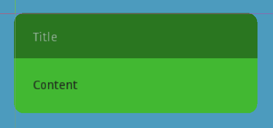

# Godot Popup Shader Dialog

This project adds a shader to a popup dialog so as to create a darker bar of color at the top of the panel. The lower part of the panel expands to fit the content.

Shader parameters are provided to specify the depth in pixels of the bar and the HSV V value for the bar and the overall color tone.

The GDScript code adapts the size and positioning when it is popped up with fresh content.

An `open` function is provided to set the title and content.
A timer hides the panel after it has been displayed for the set time.

